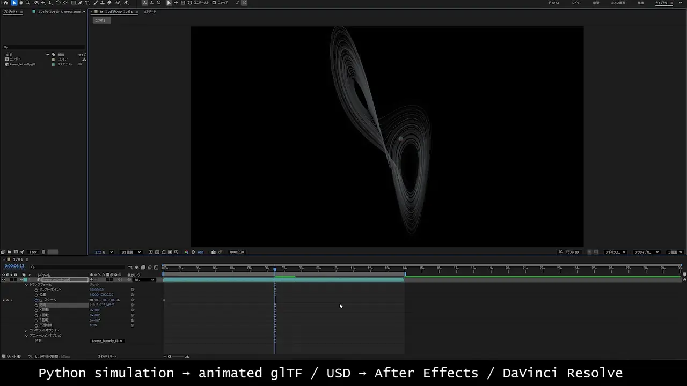

# Python Scene Handoff


**Compute motion in Python. Finish it in your DCC.**

A small proof-of-concept for handing **Python-generated, time-varying 3D scenes** to creative tools through standard interchange formats.

```text
NumPy / SciPy / simulation / procedural Python
                    ↓
              scene state S(t)
                    ↓
          destination-frame sampling
              ↙                 ↘
      animated glTF             USD
           ↓                     ↓
   After Effects          Resolve / Fusion
```

The bridge does not require Manim. Manim, SciPy, custom numerical code, VTK/PyVista data, and other Python sources are all possible front ends as long as they can produce a time-varying 3D state.

## Why this exists

Scientific and mathematical Python is excellent at computing geometry and motion. Creative DCC tools are excellent at camera work, lighting, typography, compositing, editing, and finishing.

This project keeps those jobs separate: **compute the motion in Python, then hand off a normal animated 3D asset for finishing.**

## Quick start

Requires Python 3.11–3.13 and [uv](https://docs.astral.sh/uv/). The examples are currently tested with Python 3.13.

From the repository root, open a terminal and run the following. These commands are not PowerShell-specific; the same `uv` commands can be used from PowerShell, Command Prompt, bash, or zsh.

To enable both glTF and USD outputs:

```
uv python install 3.13
uv sync --extra usd
uv run python examples/02_lorenz_butterfly.py
```

This creates:

```text
output/lorenz_butterfly.gltf
output/lorenz_butterfly.usda
```

### After Effects

Import `lorenz_butterfly.gltf`, add it to a composition, then choose:

```text
Animation Options -> Name -> Lorenz_Butterfly_Flow
```

See [After Effects handoff](docs/after-effects.md).

### Resolve / Fusion

In Fusion, load `lorenz_butterfly.usda` with a `uLoader` and connect it through the normal USD scene flow to a `uRenderer`.

See [Resolve / Fusion handoff](docs/resolve-fusion.md).

If only glTF output is needed, plain `uv sync` is sufficient.

## Showcase: Lorenz strange attractor

The hero example integrates the Lorenz system in Python and starts a narrow bundle of particles from nearly identical initial conditions.

They begin almost on top of one another, then gradually separate on the strange attractor. The presentation uses dense 60 fps motion samples, a smooth shared time map, fine attractor threads, and subtle trailing particles.

```
uv run python examples/02_lorenz_butterfly.py
```

The important part is structural: the motion comes from the numerical system, while camera work, lighting, typography, compositing, and finishing remain in the DCC.

See [Lorenz example notes](docs/lorenz-butterfly.md).

## Minimal example

For the smallest possible test:

```
uv run python examples/01_moving_cube.py
```

With USD support installed, this produces both:

```text
output/moving_cube.gltf
output/moving_cube.usda
```

The embedded glTF animation is named `MoveCube`.

## Common scene model

The shared Python-side representation is intentionally thin:

```python
scene = Scene.from_duration(fps=60, duration=4.0)

point = Node(
    "Point",
    mesh=my_mesh,
    material=Material("#7FD6FF"),
    translation_track=TranslationTrack(offsets),
)

scene.add(point)

export_gltf(scene, "output/scene.gltf", animation_name="Motion")
export_usd(scene, "output/scene.usda")
```

Today it models only what the proof-of-concept needs:

- PyVista `PolyData` geometry;
- node hierarchy;
- display color and opacity;
- sampled translation tracks;
- animated glTF export;
- USD export with time samples.

The scene model is **not** meant to grow into a replacement for OpenUSD. If the project expands toward rich materials, references, variants, cameras, lights, deformation, and composition arcs, using USD directly as the canonical scene representation should be reconsidered.

## Why dense destination-frame samples?

In the initial After Effects interoperability test, a sparse glTF animation was recognized but appeared to step at a key boundary. Baking one sample per destination frame produced smooth playback in the tested workflow.

The glTF backend therefore makes the target frame rate explicit instead of depending on a host to reproduce sparse interpolation exactly as expected.

This is a host-interoperability strategy, not a limitation of glTF itself.

USD uses the same sampled state, authored as time samples at the scene frame rate.

## Status

### Manually verified

- PyVista geometry imports into After Effects as a real 3D model.
- Multiple node translation tracks can be embedded in one glTF animation.
- Dense frame-baked glTF motion plays smoothly in the tested AE workflow.
- The same lightweight scene exports as USD and loads in Resolve/Fusion.
- Sampled translation animation plays back in the tested Resolve/Fusion workflow.

### Still intentionally small

Not yet implemented:

- rotation and scale tracks;
- cameras and lights in the common scene model;
- texture/material graphs;
- skeletal animation;
- morph targets / deforming topology;
- instancing;
- GLB output;
- automatic host axis/unit policy.

Compatibility reports are welcome.

## Architecture

```text
Python source of motion
        ↓
Scene / Node / TranslationTrack
        ↓
    ┌───────────────┐
    │               │
 glTF backend    USD backend
    │               │
After Effects   Resolve/Fusion
```

Both exporters consume the same sampled scene state. DCC-specific camera work, lighting, compositing, and finishing stay in the target application.

See [architecture notes](docs/architecture.md).

## Related work

This project sits near several established and emerging approaches:

- **pyvista-blender** — PyVista scenes handed directly to Blender, including baked animation in `.blend` files.
- **BVTKNodes** — VTK pipelines integrated inside Blender.
- **OpenUSD** — general scene description and time-varying 3D interchange.
- **usd2gltf** — USD-to-glTF conversion including animated transforms.

The narrower experiment here is a lightweight handoff from Python numerical/procedural state to standard interchange targets, without making a particular DCC part of the computation layer.

See [related work](docs/related-work.md).

## Repository layout

```text
src/python_scene_handoff/
    scene.py        lightweight common scene state
    gltf.py         animated glTF handoff
    usd.py          USD handoff
examples/
    01_moving_cube.py
    02_lorenz_butterfly.py
docs/
    after-effects.md
    resolve-fusion.md
    architecture.md
    related-work.md
```

## License

MIT. See [LICENSE](LICENSE).


## Exact pixel-plane handoff

For sensor and image diagrams, the repository now also has a small 2D path
that preserves source-pixel coordinates exactly instead of expanding every
pixel into a DCC object.

```powershell
uv run python examples/03_hot_pixel_sensor.py --birth 2
```

The default example is a 2000 x 2000 (4,000,000 pixel) RGGB Bayer plane. It
writes a compact repeating-pattern CFA SVG, a separate 1 x 1 hot-pixel SVG,
an After Effects builder JSX, and a JSON manifest.

The hot pixel remains its own AE layer and is driven by a `Hot Pixel On`
checkbox, so its birth can be represented as an instantaneous HOLD change.

The same overlay can be used over a real image:

```powershell
uv run python examples/03_hot_pixel_sensor.py \
  --width 2000 --height 2000 \
  --image D:/images/source.png \
  --grayscale --hot-color "#FF0000" --birth 2
```

See [exact pixel-plane handoff](docs/pixel-plane.md).
